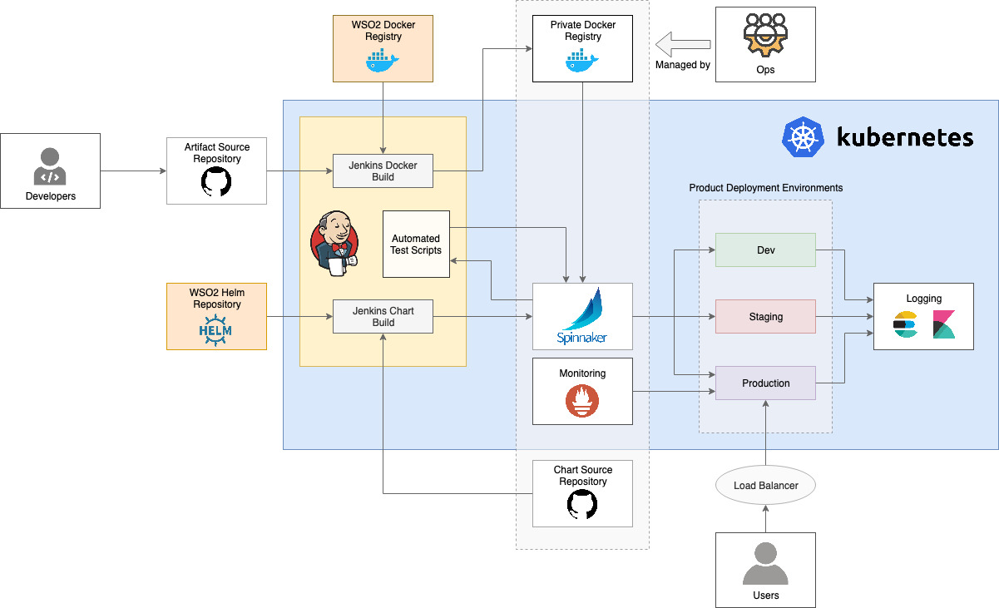

# Helm Resources for WSO2 Kubernetes Pipeline

*Helm Resources for container-based deployments of WSO2 Kubernetes Pipeline for WSO2 products*

## Overview

- WSO2 Kubernetes Pipeline provides tools and a preconfigured pipeline used for continuous integration and deployment.
The setup is deployed on top of Kubernetes using Helm, which makes the processes of configuring, installing, scaling and upgrading, quite simple.

- Following are the tools used to install and monitor the pipeline

  - Jenkins: For continuous integration
  - Spinnaker: For continuous deployment to Kubernetes
  - ELK: For centralized logging
  - Prometheus Operator: For monitoring deployments and visualization using Grafana

### Installation

Use the following, **Getting Started** guides to install the Kubernetes Pipeline, for the respective WSO2 product.

* [Getting Started with Kubernetes Pipeline for WSO2 Enterprise Integration](docs/getting-started-ei.md)

* [Getting Started with Kubernetes Pipeline for WSO2 Identity and Access Management](docs/getting-started-is.md)

* [Getting Started with Kubernetes Pipeline for WSO2 API Management](docs/getting-started-mgw.md)

## Advanced Topics

* [Using ingress with SSL/TLS](./docs/advanced/using-ingress-with-tls.md)

## How You Can Contribute

For detailed information on how you can contribute to this Git repository, please refer [this](CONTRIBUTING.md) documentation.
